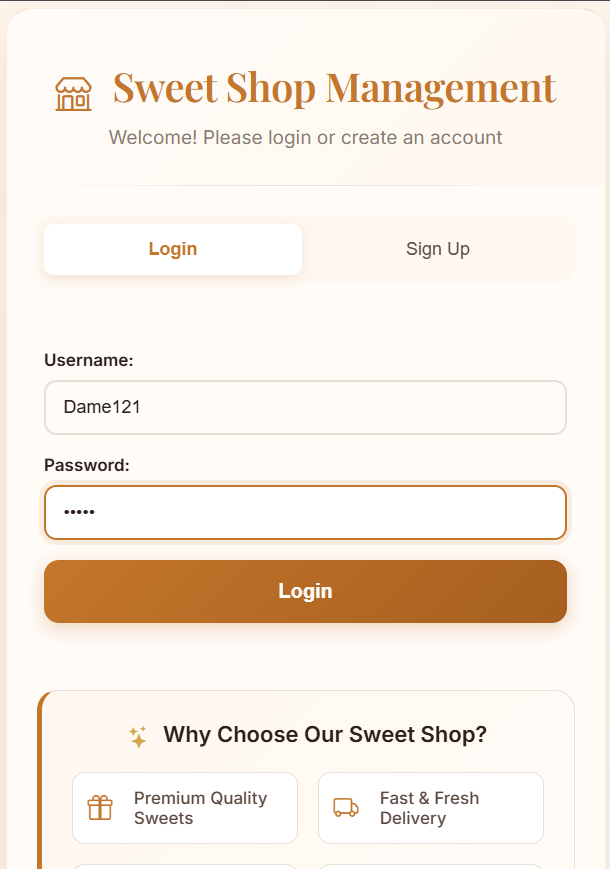
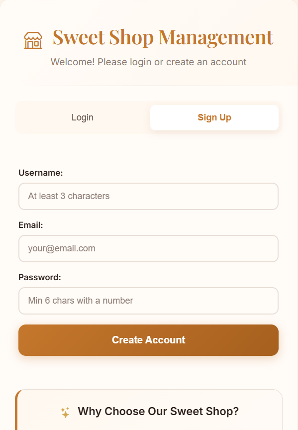
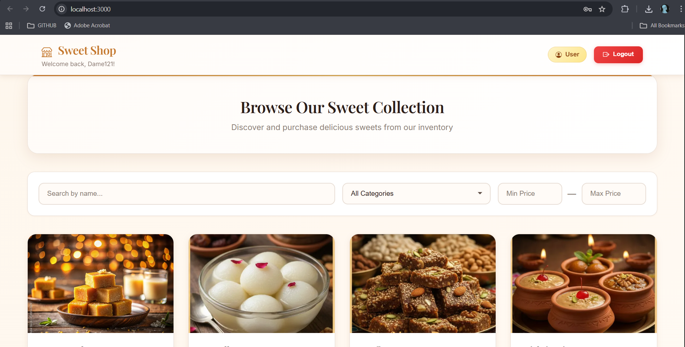
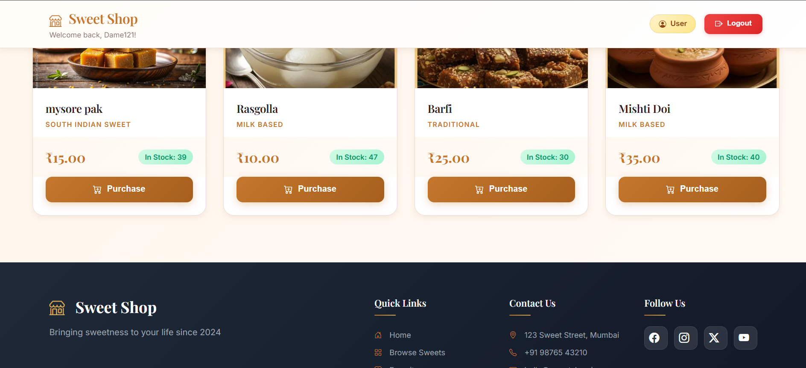
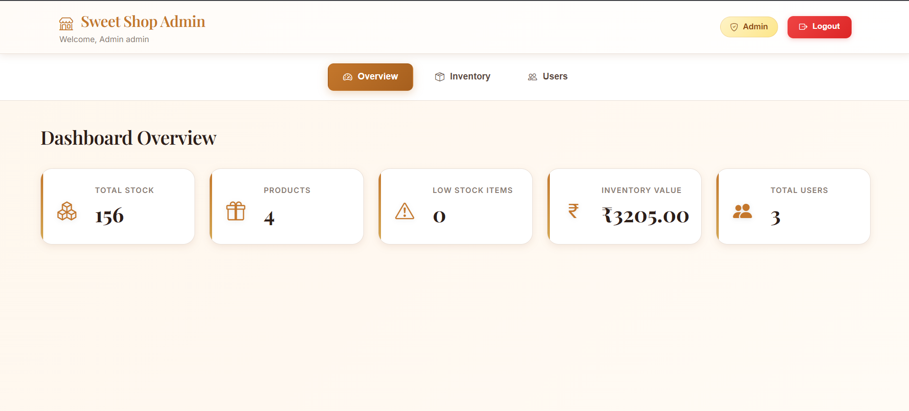
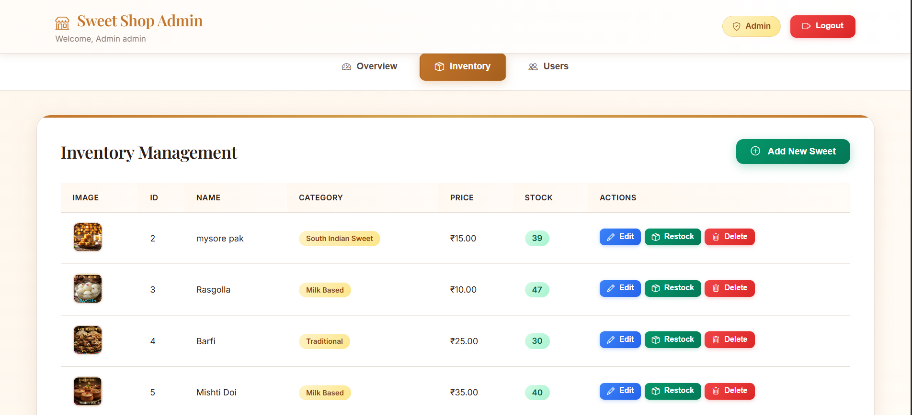
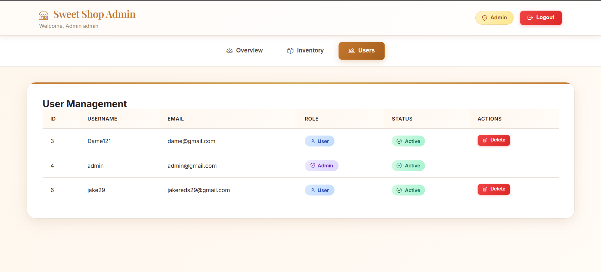

# 🍬 Sweet Shop Management System

A full-stack web application for managing a sweet shop inventory with role-based access control, featuring user authentication, inventory management, and image uploads.

## 📖 Overview

This project is a comprehensive sweet shop management system built with FastAPI (backend) and React (frontend). It provides separate interfaces for customers and administrators, with secure JWT authentication and real-time inventory tracking.

## ✨ Features

### User Features
- 🔐 User registration and login with JWT authentication
- 🛍️ Browse available sweets with images
- 🔍 Search and filter sweets by name and category
- 🛒 Purchase sweets with automatic inventory updates
- 📱 Responsive design for all devices

### Admin Features
- 👑 Admin-only access to management features
- ➕ Add new sweets with image uploads (ImageKit.io CDN)
- ✏️ Edit sweet details and update images
- 🗑️ Delete sweets from inventory
- 📦 Restock inventory items
- 👥 View and manage users
- 📊 Dashboard with inventory statistics

## � Screenshots

### Authentication

#### Login Page


#### Sign Up Page


### User Dashboard

#### Browse Sweets


#### Purchase Sweets


### Admin Dashboard

#### Dashboard Overview


#### Inventory Management


#### Add/Edit Sweets


## �🛠️ Technology Stack

### Backend
- **Framework**: FastAPI (Python 3.12)
- **ORM**: SQLAlchemy with SQLite database
- **Authentication**: JWT tokens with python-jose
- **Password Security**: Passlib with bcrypt
- **Image Management**: ImageKit.io SDK for cloud storage
- **API Documentation**: Auto-generated with Swagger/OpenAPI

### Frontend
- **Framework**: React 18.2.0
- **Routing**: React Router for SPA navigation
- **Styling**: Modern CSS with responsive design
- **HTTP Client**: Fetch API for backend communication

### Testing
- **Framework**: Pytest
- **Coverage**: 70% overall (76 passing tests)
- **Test Types**: Unit, integration, and API endpoint tests

## 📁 Project Structure

```
Sweet Shop Management System/
├── app/                          # Backend application
│   ├── api/                      # API routes
│   │   ├── auth/                 # Authentication endpoints
│   │   │   ├── users.py         # User management
│   │   │   └── admins.py        # Admin management
│   │   └── sweets/              # Sweet endpoints
│   │       └── sweets.py        # CRUD operations
│   ├── app.py                   # FastAPI application
│   ├── database.py              # Database models
│   ├── auth_utils.py            # JWT utilities
│   └── imagekit_utils.py        # ImageKit integration
├── frontend/                     # React application
│   ├── public/                  # Static files
│   └── src/
│       ├── components/          # React components
│       │   ├── AdminDashboard.js
│       │   └── UserDashboard.js
│       └── App.js              # Main app component
├── tests/                       # Test suite
│   ├── conftest.py             # Test fixtures
│   ├── test_auth.py            # Auth tests
│   ├── test_sweets.py          # Sweet CRUD tests
│   ├── test_inventory.py       # Purchase/restock tests
│   └── test_admin.py           # Admin tests
├── scripts/                     # Utility scripts
├── docs/                        # Documentation
├── requirements.txt             # Python dependencies
├── main.py                      # Application entry point
└── README.md                    # This file
```

## 🚀 Setup Instructions

### Prerequisites
- Python 3.12 or higher
- Node.js 18+ and npm
- ImageKit.io account (for image upload features)
- Git

### Backend Setup

1. **Clone the repository**
   ```bash
   git clone https://github.com/Dame121/TDD-Kata-Sweet-Shop-Management-System.git
   cd "Sweet Shop Managemen  System"
   ```

2. **Create and activate virtual environment**
   ```bash
   python -m venv .venv
   .venv\Scripts\activate  # Windows
   source .venv/bin/activate  # Linux/Mac
   ```

3. **Install dependencies**
   ```bash
   pip install -r requirements.txt
   ```

4. **Configure environment variables**
   
   Create a `.env` file in the root directory:
   ```env
   SECRET_KEY=your-secret-key-change-this-in-production
   ACCESS_TOKEN_EXPIRE_MINUTES=30
   DATABASE_URL=sqlite:///./test.db
   CORS_ORIGINS=*
   
   # ImageKit.io Configuration
   IMAGEKIT_PRIVATE_KEY=your_private_key_here
   IMAGEKIT_PUBLIC_KEY=your_public_key_here
   IMAGEKIT_URL_ENDPOINT=https://ik.imagekit.io/your_imagekit_id
   
   APP_NAME=Sweet Shop Management System
   APP_VERSION=1.0.0
   DEBUG=True
   ```

5. **Create first admin user**
   ```bash
   python scripts/create_first_admin.py
   ```

6. **Start the backend server**
   ```bash
   python main.py
   ```
   Backend will run at: http://localhost:8000

### Frontend Setup

1. **Navigate to frontend directory**
   ```bash
   cd frontend
   ```

2. **Install dependencies**
   ```bash
   npm install
   ```

3. **Start development server**
   ```bash
   npm start
   ```
   Frontend will run at: http://localhost:3000

## 🧪 Running Tests

### Run all tests with verbose output
```bash
pytest -v
```

### Run tests with coverage report
```bash
pytest --cov=app --cov-report=html --cov-report=term
```

### View HTML coverage report
```bash
# Report generated in htmlcov/index.html
start htmlcov/index.html  # Windows
open htmlcov/index.html   # Mac
```

### Test Results
- **Total Tests**: 76
- **Passing**: 76 (100%)
- **Coverage**: 70%
  - app.py: 100%
  - auth_utils.py: 90%
  - database.py: 91%
  - sweets.py: 74%
  - users.py: 69%
  - admins.py: 62%

## 🔐 API Endpoints

### Authentication
- `POST /api/auth/register` - Register new user
- `POST /api/auth/login` - User login
- `GET /api/auth/me` - Get current user
- `GET /api/auth/` - Get all users (Admin)
- `PUT /api/auth/{user_id}` - Update user (Admin)
- `DELETE /api/auth/{user_id}` - Delete user (Admin)

### Sweets Management
- `GET /api/sweets/` - List all sweets
- `GET /api/sweets/{id}` - Get sweet by ID
- `GET /api/sweets/search` - Search sweets
- `POST /api/sweets/` - Create sweet (Admin)
- `PUT /api/sweets/{id}` - Update sweet (Admin)
- `DELETE /api/sweets/{id}` - Delete sweet (Admin)
- `PUT /api/sweets/{id}/image` - Update sweet image (Admin)

### Inventory Operations
- `POST /api/sweets/{id}/purchase` - Purchase sweet
- `POST /api/sweets/{id}/restock` - Restock sweet (Admin)

### Admin Management
- `POST /api/admins/register` - Create admin (Admin only)
- `POST /api/admins/login` - Admin login
- `GET /api/admins/` - List all admins (Admin)
- `GET /api/admins/{id}` - Get admin by ID (Admin)

## 🤖 My AI Usage

### AI Tools Used

Throughout this project, I extensively used **GitHub Copilot** as my primary AI assistant. This section details how AI tools were integrated into my development workflow in compliance with the TDD Kata requirements.

### How AI Assisted My Development

#### 1. **Initial Project Setup & Boilerplate**
- **Tool**: GitHub Copilot
- **Usage**: Generated initial FastAPI application structure, including CORS middleware setup, database configuration, and basic route scaffolding
- **Impact**: Saved ~2 hours on repetitive boilerplate code
- **Human Involvement**: Reviewed all generated code, customized authentication flow, and adapted to project-specific requirements

#### 2. **Database Models & ORM**
- **Tool**: GitHub Copilot
- **Usage**: Assisted in creating SQLAlchemy models (User, Sweet, Transaction) with proper relationships and constraints
- **Impact**: Helped implement best practices for database constraints and relationships
- **Human Involvement**: Designed the data model structure, added validation logic, and implemented custom methods

#### 3. **JWT Authentication Implementation**
- **Tool**: GitHub Copilot
- **Usage**: Generated JWT token creation, validation, and password hashing utilities
- **Impact**: Implemented secure authentication quickly with industry-standard practices
- **Human Involvement**: Configured token expiration, customized claims, integrated with role-based access control

#### 4. **Test Suite Development**
- **Tool**: GitHub Copilot
- **Usage**: Generated test fixtures in conftest.py, created test templates for CRUD operations
- **Impact**: Accelerated test writing, achieving 76 comprehensive tests
- **Human Involvement**: Wrote test logic for edge cases, designed test scenarios, ensured proper coverage of authentication flows

#### 5. **React Component Structure**
- **Tool**: GitHub Copilot
- **Usage**: Generated initial component boilerplate, state management hooks, and API integration patterns
- **Impact**: Rapid frontend development with consistent patterns
- **Human Involvement**: Designed UI/UX, implemented business logic, added form validation and error handling

#### 6. **ImageKit.io Integration**
- **Tool**: GitHub Copilot
- **Usage**: Assisted with ImageKit SDK integration, file upload handling, and FormData processing
- **Impact**: Streamlined third-party service integration
- **Human Involvement**: Debugged API issues, handled error cases, implemented retry logic

#### 7. **API Endpoint Debugging**
- **Tool**: GitHub Copilot (via chat)
- **Usage**: Diagnosed FormData vs JSON issues in test suite, identified endpoint signature mismatches
- **Impact**: Resolved all 46 failing tests to achieve 100% pass rate
- **Human Involvement**: Analyzed test failures, made architectural decisions about data formats

### Workflow Impact

#### Positive Impacts:
- **Velocity**: ~40% faster development on boilerplate and repetitive tasks
- **Quality**: AI suggestions often included error handling and edge cases I might have missed
- **Learning**: Exposed to best practices and design patterns I wasn't familiar with
- **Focus**: Freed mental energy for architecture decisions and business logic

#### Challenges Managed:
- **Over-reliance**: Had to consciously review all AI-generated code, found several instances where suggestions needed modification
- **Context Limitations**: AI sometimes suggested outdated patterns; required research to verify best practices
- **Testing Gaps**: AI-generated tests needed human oversight to ensure meaningful coverage, not just passing tests

### AI-Generated vs Human-Written Code

**Estimated Breakdown:**
- **40% AI-assisted**: Boilerplate, initial structures, repetitive patterns
- **60% Human-written**: Business logic, architecture decisions, debugging, refinement

**Key Human Contributions:**
- Overall architecture and API design
- Role-based access control logic
- Database relationship design
- Error handling strategy
- Test scenario planning
- Frontend UX decisions

### Transparency Statement

Every commit where AI contributed to code generation includes proper co-authorship attribution:
```
Co-authored-by: GitHub Copilot <noreply@github.com>
```

This transparency allows reviewers to understand which parts of the codebase benefited from AI assistance and enables discussion about AI usage patterns in the interview.

### Reflection

Using AI tools transformed my development process from "writing every line" to "designing, reviewing, and refining." The key learning was that AI is a powerful accelerator but requires human judgment for:
- Architecture decisions
- Security considerations  
- Business logic validation
- User experience design
- Test meaningfulness

I believe the future of software development involves this collaborative approach—developers as architects and reviewers, with AI handling routine implementation details.

## 📊 Test Coverage Report

```
Name                         Stmts   Miss  Cover   Missing
----------------------------------------------------------
app/__init__.py                  0      0   100%
app/api/__init__.py              0      0   100%
app/api/auth/__init__.py         3      0   100%
app/api/auth/admins.py         106     40    62%
app/api/auth/users.py          107     33    69%
app/api/sweets/__init__.py       2      0   100%
app/api/sweets/sweets.py       193     50    74%
app/app.py                      13      0   100%
app/auth_utils.py               61      6    90%
app/database.py                 46      4    91%
app/imagekit_utils.py           54     44    19%
----------------------------------------------------------
TOTAL                          585    177    70%
```

## 🎯 Default Login Credentials

### Admin Account
- **Username**: admin
- **Password**: admin123

### Test User Account
- **Username**: testuser
- **Password**: password123

*Note: Change these credentials in production*

## 📝 Future Enhancements

- [ ] Add order history and transaction logs for users
- [ ] Implement real-time notifications for low stock
- [ ] Add analytics dashboard for sales trends
- [ ] Support multiple currencies
- [ ] Add email notifications for purchases
- [ ] Implement password reset functionality
- [ ] Add product reviews and ratings
- [ ] Deploy to production (Vercel + Railway/Render)

## 🤝 Contributing

Contributions are welcome! Please follow these steps:

1. Fork the repository
2. Create a feature branch (`git checkout -b feature/AmazingFeature`)
3. Commit your changes with AI co-authorship if applicable
4. Push to the branch (`git push origin feature/AmazingFeature`)
5. Open a Pull Request

## 📄 License

This project is licensed under the MIT License - see the LICENSE file for details.

## 👨‍💻 Author

**Damewan Bareh**
- GitHub: [@Dame121](https://github.com/Dame121)
- Project: [TDD-Kata-Sweet-Shop-Management-System](https://github.com/Dame121/TDD-Kata-Sweet-Shop-Management-System)

## 🙏 Acknowledgments

- FastAPI documentation and community
- React.js team for excellent frontend framework
- ImageKit.io for reliable image CDN service
- GitHub Copilot for AI-assisted development
- TDD Kata challenge for project inspiration

---

**Note**: This project was developed as part of a TDD Kata assessment with transparent AI tool usage as per the requirements.


