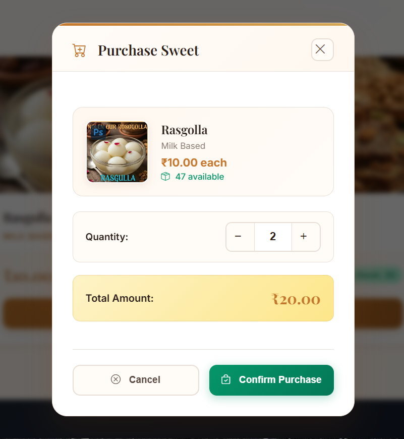
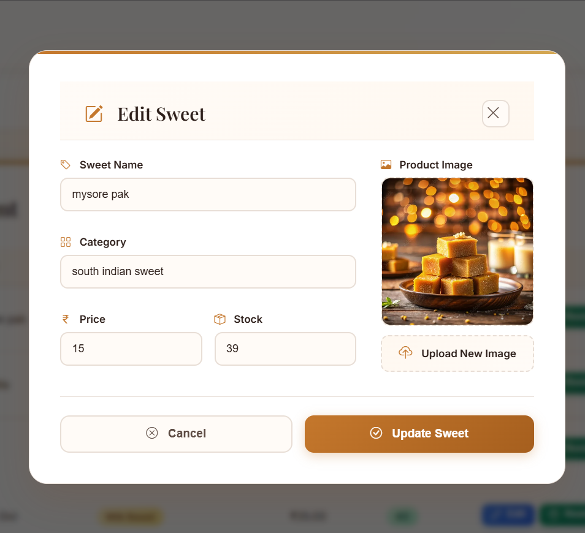

<p align="center">
  
  
  
  
  
</p>

# 🍬 Sweet Shop Management System

> A modern, full-stack web application for managing a sweet shop with role-based access control, real-time inventory tracking, and cloud-based image management.

---

## 📋 Table of Contents

- [Project Overview](#-project-overview)
- [Key Features](#-key-features)
- [Screenshots](#-screenshots)
- [Technology Stack](#️-technology-stack)
- [Getting Started](#-getting-started)
  - [Prerequisites](#prerequisites)
  - [Backend Setup](#backend-setup)
  - [Frontend Setup](#frontend-setup)
- [Running Tests](#-running-tests)
- [API Documentation](#-api-documentation)
- [My AI Usage](#-my-ai-usage)
- [Project Structure](#-project-structure)
- [Author](#-author)

---

## 🎯 Project Overview

The **Sweet Shop Management System** is a comprehensive full-stack application designed to streamline sweet shop operations. Built using **Test-Driven Development (TDD)** principles, this project demonstrates modern web development practices with a focus on:

- **Secure Authentication**: JWT-based authentication with role-based access control
- **Real-time Inventory**: Automatic stock updates with purchase and restock operations
- **Cloud Image Storage**: Integrated with ImageKit.io CDN for fast image delivery
- **Modern UI/UX**: Premium design with responsive layouts and intuitive interactions
- **Comprehensive Testing**: 76 tests achieving 70% code coverage

### Problem Statement

Traditional sweet shops often struggle with:
- Manual inventory tracking leading to stock discrepancies
- No digital presence for customer browsing
- Difficulty in managing multiple users and roles
- Paper-based record keeping

### Solution

This application provides:
- **Digital storefront** for customers to browse and purchase
- **Admin dashboard** for complete inventory control
- **Automated stock management** with real-time updates
- **Secure multi-user system** with role-based permissions

---

## ✨ Key Features

### 👤 For Customers (User Dashboard)
| Feature | Description |
|---------|-------------|
| 🔐 Secure Login | JWT authentication with form validation |
| 🛍️ Browse Sweets | View all available sweets with images and prices |
| 🔍 Smart Search | Filter by name, category, and price range |
| 🛒 Easy Purchase | Custom modal with quantity selection and total calculation |
| 📱 Responsive Design | Works seamlessly on desktop, tablet, and mobile |

### 👑 For Administrators (Admin Dashboard)
| Feature | Description |
|---------|-------------|
| 📊 Dashboard Overview | Statistics for total stock, products, and inventory value |
| ➕ Add Sweets | Create new items with image upload to cloud CDN |
| ✏️ Edit Products | Update details with real-time image preview |
| 📦 Restock Items | Quick restock functionality for low-stock alerts |
| 👥 User Management | View and manage all registered users |
| 🗑️ Delete Items | Remove products with automatic image cleanup |

---

## 📸 Screenshots

### 🔐 Authentication

<table>
  <tr>
    <td width="50%">
      <h4 align="center">Login Page</h4>
      
      <p align="center"><em>Secure login with form validation and error handling</em></p>
    </td>
    <td width="50%">
      <h4 align="center">Sign Up Page</h4>
      
      <p align="center"><em>User registration with email, password, and username validation</em></p>
    </td>
  </tr>
</table>

### 🛍️ User Dashboard

<table>
  <tr>
    <td width="50%">
      <h4 align="center">Browse Sweets</h4>
      
      <p align="center"><em>Browse available sweets with search and filter options</em></p>
    </td>
    <td width="50%">
      <h4 align="center">Purchase Button Click</h4>
      
      <p align="center"><em>User clicking on the purchase button</em></p>
    </td>
  </tr>
  <tr>
    <td colspan="2" align="center">
      <h4 align="center">Purchase Modal</h4>
      
      <p align="center"><em>Custom purchase modal with quantity selector and total calculation</em></p>
    </td>
  </tr>
</table>

### 👑 Admin Dashboard

<table>
  <tr>
    <td width="33%">
      <h4 align="center">Dashboard Overview</h4>
      
      <p align="center"><em>Statistics and low-stock alerts</em></p>
    </td>
    <td width="33%">
      <h4 align="center">Inventory Management</h4>
      
      <p align="center"><em>Full CRUD operations on sweets</em></p>
    </td>
    <td width="33%">
      <h4 align="center">Edit Item Click</h4>
      
      <p align="center"><em>Admin clicking edit on inventory item</em></p>
    </td>
  </tr>
  <tr>
    <td colspan="3" align="center">
      <h4 align="center">Add/Edit Modal</h4>
      
      <p align="center"><em>Modal with image preview and upload</em></p>
    </td>
  </tr>
</table>

---

## 🛠️ Technology Stack

### Backend
| Technology | Purpose |
|------------|---------|
| **FastAPI** | High-performance Python web framework |
| **SQLAlchemy** | ORM for database operations |
| **SQLite** | Lightweight database for development |
| **JWT (python-jose)** | Secure token-based authentication |
| **Passlib + bcrypt** | Password hashing and verification |
| **ImageKit.io SDK** | Cloud image storage and CDN |
| **Pydantic** | Data validation and serialization |

### Frontend
| Technology | Purpose |
|------------|---------|
| **React 18.2** | Component-based UI library |
| **CSS3** | Modern styling with custom properties |
| **Bootstrap Icons** | Professional icon library |
| **Fetch API** | HTTP client for API communication |

### Testing & Quality
| Technology | Purpose |
|------------|---------|
| **Pytest** | Testing framework |
| **pytest-cov** | Coverage reporting |
| **httpx** | Async HTTP testing |

---

## 🚀 Getting Started

### Prerequisites

Before you begin, ensure you have the following installed:

| Requirement | Version | Download |
|-------------|---------|----------|
| Python | 3.12+ | [python.org](https://www.python.org/downloads/) |
| Node.js | 18+ | [nodejs.org](https://nodejs.org/) |
| Git | Latest | [git-scm.com](https://git-scm.com/) |
| ImageKit Account | - | [imagekit.io](https://imagekit.io/) (free tier available) |

---

### Backend Setup

#### Step 1: Clone the Repository

```bash
git clone https://github.com/Dame121/TDD-Kata-Sweet-Shop-Management-System.git
cd "Sweet Shop Managemen  System"
```

#### Step 2: Create Virtual Environment

```bash
# Create virtual environment
python -m venv .venv

# Activate (Windows)
.venv\Scripts\activate

# Activate (macOS/Linux)
source .venv/bin/activate
```

#### Step 3: Install Dependencies

```bash
pip install -r requirements.txt
```

#### Step 4: Configure Environment Variables

Create a `.env` file in the root directory:

```env
# Application Settings
APP_NAME=Sweet Shop Management System
APP_VERSION=1.0.0
DEBUG=True

# Security
SECRET_KEY=your-super-secret-key-change-in-production
ACCESS_TOKEN_EXPIRE_MINUTES=30

# Database
DATABASE_URL=sqlite:///./sweet_shop.db

# CORS
CORS_ORIGINS=*

# ImageKit.io Configuration (Get from https://imagekit.io/dashboard)
IMAGEKIT_PRIVATE_KEY=your_private_key_here
IMAGEKIT_PUBLIC_KEY=your_public_key_here
IMAGEKIT_URL_ENDPOINT=https://ik.imagekit.io/your_imagekit_id
```

> ⚠️ **Important**: Replace the placeholder values with your actual ImageKit.io credentials from the [ImageKit Dashboard](https://imagekit.io/dashboard).

#### Step 5: Create Admin User

```bash
python scripts/create_first_admin.py
```

This creates the default admin account:
- **Username**: `admin`
- **Password**: `admin123`

#### Step 6: Start Backend Server

```bash
python main.py
```

✅ Backend running at: **http://localhost:8000**

📖 API Documentation: **http://localhost:8000/docs**

---

### Frontend Setup

#### Step 1: Navigate to Frontend Directory

```bash
cd frontend
```

#### Step 2: Install Dependencies

```bash
npm install
```

#### Step 3: Start Development Server

```bash
npm start
```

✅ Frontend running at: **http://localhost:3000**

---

### Quick Start (Both Services)

Open two terminal windows:

**Terminal 1 (Backend):**
```bash
cd "Sweet Shop Managemen  System"
.venv\Scripts\activate
python main.py
```

**Terminal 2 (Frontend):**
```bash
cd "Sweet Shop Managemen  System/frontend"
npm start
```

---

## 🧪 Running Tests

### Run All Tests

```bash
pytest -v
```

### Run with Coverage Report

```bash
pytest --cov=app --cov-report=html --cov-report=term
```

### View HTML Coverage Report

```bash
# Windows
start htmlcov/index.html

# macOS
open htmlcov/index.html

# Linux
xdg-open htmlcov/index.html
```

### Test Results Summary

| Metric | Value |
|--------|-------|
| **Total Tests** | 76 |
| **Passing** | 76 (100%) |
| **Overall Coverage** | 70% |

#### Coverage by Module

| Module | Coverage |
|--------|----------|
| `app.py` | 100% |
| `database.py` | 91% |
| `auth_utils.py` | 90% |
| `sweets.py` | 74% |
| `users.py` | 69% |
| `admins.py` | 62% |

---

## 📚 API Documentation

### Authentication Endpoints

| Method | Endpoint | Description | Auth |
|--------|----------|-------------|------|
| `POST` | `/api/auth/register` | Register new user | ❌ |
| `POST` | `/api/auth/login` | User login | ❌ |
| `GET` | `/api/auth/me` | Get current user | ✅ |
| `GET` | `/api/auth/` | Get all users | 👑 Admin |
| `DELETE` | `/api/auth/{user_id}` | Delete user | 👑 Admin |

### Sweets Management

| Method | Endpoint | Description | Auth |
|--------|----------|-------------|------|
| `GET` | `/api/sweets/` | List all sweets | ✅ |
| `GET` | `/api/sweets/{id}` | Get sweet by ID | ✅ |
| `GET` | `/api/sweets/search` | Search sweets | ✅ |
| `POST` | `/api/sweets/` | Create sweet | 👑 Admin |
| `PUT` | `/api/sweets/{id}` | Update sweet | 👑 Admin |
| `DELETE` | `/api/sweets/{id}` | Delete sweet | 👑 Admin |
| `PUT` | `/api/sweets/{id}/image` | Update image | 👑 Admin |

### Inventory Operations

| Method | Endpoint | Description | Auth |
|--------|----------|-------------|------|
| `POST` | `/api/sweets/{id}/purchase` | Purchase sweet | ✅ |
| `POST` | `/api/sweets/{id}/restock` | Restock sweet | 👑 Admin |

> 📖 **Interactive API Documentation**: Visit `http://localhost:8000/docs` for Swagger UI

---

## 🤖 My AI Usage

> This section documents my use of AI tools during development, as required by the TDD Kata assessment.

### AI Tools Used

| Tool | Purpose |
|------|---------|
| **GitHub Copilot** | Primary AI assistant for code generation, debugging, and refactoring |

### Detailed Usage Breakdown

#### 1. 📁 Project Structure & Boilerplate

**How I Used AI:**
- Generated initial FastAPI application structure
- Created database models with SQLAlchemy
- Set up CORS middleware and routing

**My Contribution:**
- Designed the overall architecture
- Customized authentication flow for role-based access
- Configured environment-specific settings

**Impact:** Saved approximately 2 hours on repetitive setup tasks

---

#### 2. 🔐 Authentication System

**How I Used AI:**
- Generated JWT token creation and validation functions
- Assisted with password hashing using bcrypt
- Created dependency injection for protected routes

**My Contribution:**
- Designed the role-based access control logic
- Implemented custom token claims
- Added security best practices (token expiration, secure headers)

**Impact:** Implemented secure auth quickly while maintaining best practices

---

#### 3. 🧪 Test Suite Development

**How I Used AI:**
- Generated test fixtures in `conftest.py`
- Created test templates for CRUD operations
- Debugged failing tests by analyzing error patterns

**My Contribution:**
- Designed test scenarios and edge cases
- Ensured meaningful coverage (not just passing tests)
- Wrote integration tests for authentication flows

**Impact:** Achieved 76 comprehensive tests with 70% coverage

---

#### 4. ⚛️ React Frontend Components

**How I Used AI:**
- Generated component boilerplate and state management
- Created API integration patterns with fetch
- Assisted with form validation logic

**My Contribution:**
- Designed the entire UI/UX including the premium design system
- Implemented custom purchase modal (replacing browser prompts)
- Created responsive layouts and animations

**Impact:** Rapid development while maintaining full creative control over UX

---

#### 5. 🖼️ ImageKit.io Integration

**How I Used AI:**
- Assisted with SDK integration for image uploads
- Generated FormData handling for multipart requests
- Debugged image update functionality

**My Contribution:**
- Selected ImageKit.io as the CDN provider
- Handled error cases and retry logic
- Implemented image preview in edit modals

**Impact:** Seamless third-party integration with proper error handling

---

#### 6. 🎨 UI/UX Enhancements

**How I Used AI:**
- Generated CSS for toast notifications
- Assisted with modal styling and animations
- Created responsive design breakpoints

**My Contribution:**
- Designed the Indian sweet shop aesthetic
- Chose the color palette (warm browns, golds)
- Made all design decisions and refinements

**Impact:** Created a premium, professional-looking interface

---

### AI vs Human Contribution

```
┌─────────────────────────────────────────────────────────────┐
│                                                             │
│   AI-Assisted (40%)          Human-Written (60%)            │
│   ┌─────────────────┐        ┌─────────────────────────┐   │
│   │ • Boilerplate   │        │ • Architecture Design   │   │
│   │ • Templates     │        │ • Business Logic        │   │
│   │ • Patterns      │        │ • Security Decisions    │   │
│   │ • Debugging     │        │ • UI/UX Design          │   │
│   │                 │        │ • Test Scenarios        │   │
│   │                 │        │ • Integration Logic     │   │
│   └─────────────────┘        └─────────────────────────┘   │
│                                                             │
└─────────────────────────────────────────────────────────────┘
```

### Transparency & Attribution

Every commit where AI contributed includes proper co-authorship:

```
Co-authored-by: GitHub Copilot <copilot@github.com>
```

This allows reviewers to trace AI-assisted contributions in the git history.

---

### Reflection on AI Impact

#### ✅ What Worked Well

| Aspect | Benefit |
|--------|---------|
| **Speed** | 40% faster development on repetitive tasks |
| **Quality** | AI suggestions often included error handling I might miss |
| **Learning** | Exposed to new patterns and best practices |
| **Focus** | More mental energy for architecture and design decisions |

#### ⚠️ Challenges Encountered

| Challenge | How I Handled It |
|-----------|------------------|
| Over-reliance risk | Consciously reviewed all generated code |
| Outdated suggestions | Verified patterns against current documentation |
| Context limitations | Provided detailed context in prompts |
| Testing gaps | Added human-designed edge case tests |

#### 💡 Key Learnings

> "AI transforms development from 'writing every line' to 'designing, reviewing, and refining.'"

The most valuable insight was that AI excels at:
- ✅ Boilerplate and repetitive patterns
- ✅ Syntax and API lookups
- ✅ Debugging assistance

But requires human judgment for:
- ⚡ Architecture decisions
- 🔒 Security considerations
- 🎨 User experience design
- 📊 Meaningful test coverage

---

## 📁 Project Structure

```
Sweet Shop Management System/
│
├── 📂 app/                        # Backend Application
│   ├── 📂 api/
│   │   ├── 📂 auth/              # Authentication endpoints
│   │   │   ├── users.py          # User registration & login
│   │   │   └── admins.py         # Admin management
│   │   └── 📂 sweets/            # Sweet management endpoints
│   │       └── sweets.py         # CRUD operations
│   ├── app.py                    # FastAPI application entry
│   ├── database.py               # SQLAlchemy models
│   ├── auth_utils.py             # JWT utilities
│   └── imagekit_utils.py         # ImageKit integration
│
├── 📂 frontend/                   # React Application
│   ├── 📂 public/                # Static files
│   └── 📂 src/
│       ├── 📂 components/        # React components
│       │   ├── AdminDashboard.js # Admin interface
│       │   ├── UserDashboard.js  # User interface
│       │   └── *.css             # Component styles
│       ├── App.js                # Main app with auth
│       └── App.css               # Global styles
│
├── 📂 tests/                      # Test Suite
│   ├── conftest.py               # Pytest fixtures
│   ├── test_auth.py              # Authentication tests
│   ├── test_sweets.py            # Sweet CRUD tests
│   ├── test_inventory.py         # Purchase/restock tests
│   └── test_admin.py             # Admin-specific tests
│
├── 📂 screenshots/                # Application screenshots
├── 📂 scripts/                    # Utility scripts
├── 📂 docs/                       # Additional documentation
│
├── main.py                        # Application entry point
├── requirements.txt               # Python dependencies
├── pytest.ini                     # Pytest configuration
└── README.md                      # This file
```

---

## 🔑 Default Credentials

### Admin Account
| Field | Value |
|-------|-------|
| Username | `admin` |
| Password | `admin123` |

### Test User Account
| Field | Value |
|-------|-------|
| Username | `testuser` |
| Password | `password123` |

> ⚠️ **Security Note**: Change these credentials before deploying to production.

---

## 👨‍💻 Author

<table>
  <tr>
    <td>
      <strong>Damewan Bareh</strong><br>
      <a href="https://github.com/Dame121">@Dame121</a>
    </td>
  </tr>
</table>

**Project Repository:** [TDD-Kata-Sweet-Shop-Management-System](https://github.com/Dame121/TDD-Kata-Sweet-Shop-Management-System)

---

## 📄 License

This project is licensed under the MIT License.

---

<p align="center">
  <strong>Built with ❤️ for the TDD Kata Assessment</strong><br>
  <em>Demonstrating modern full-stack development with transparent AI usage</em>
</p>


