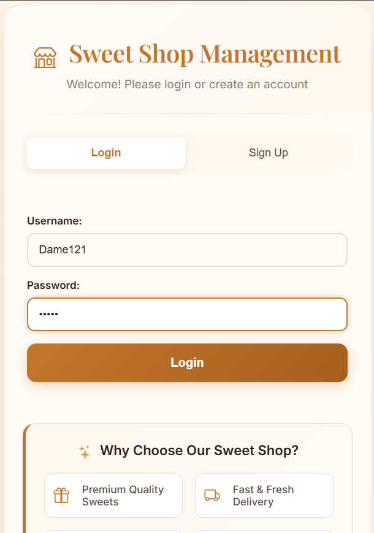
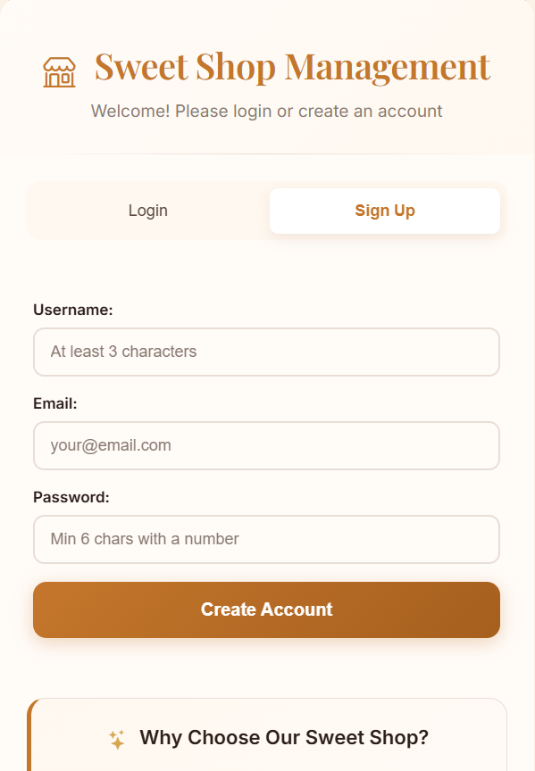
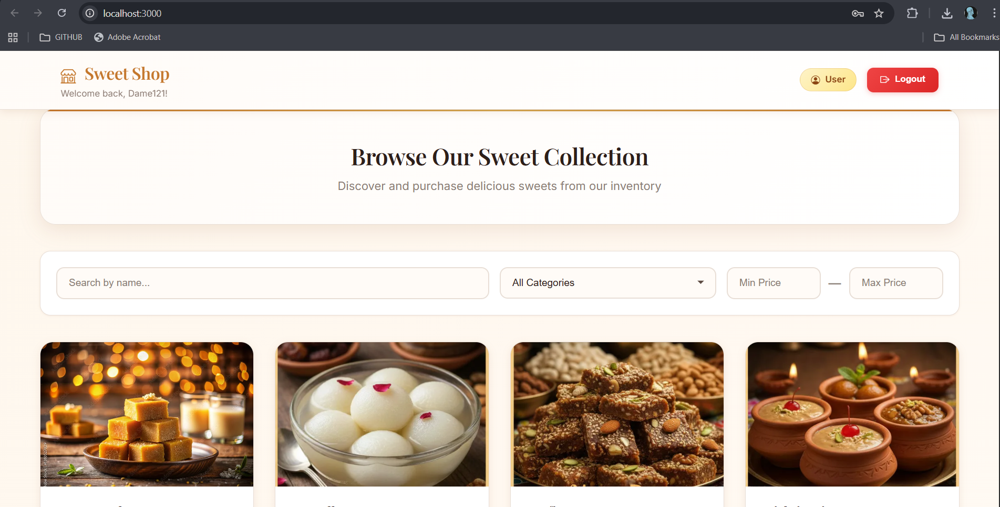
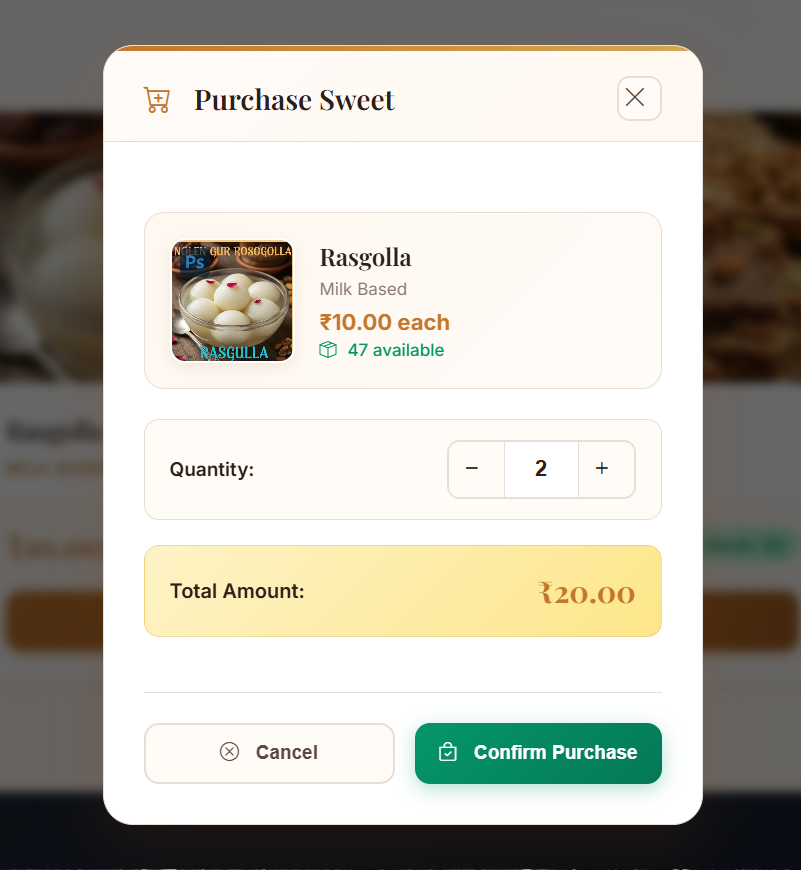
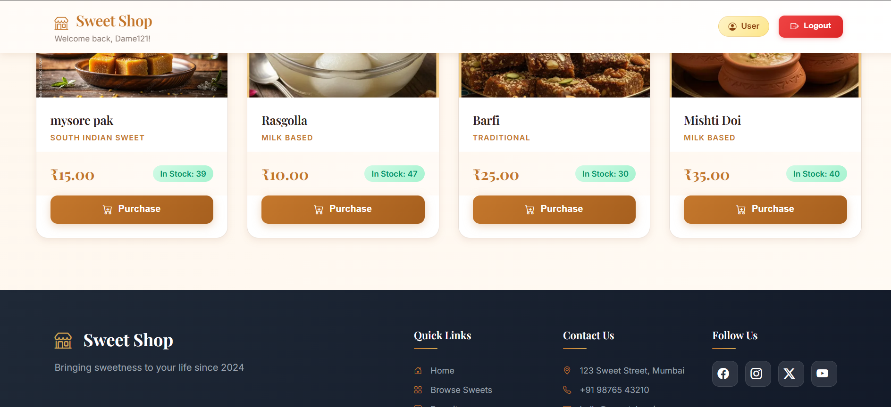
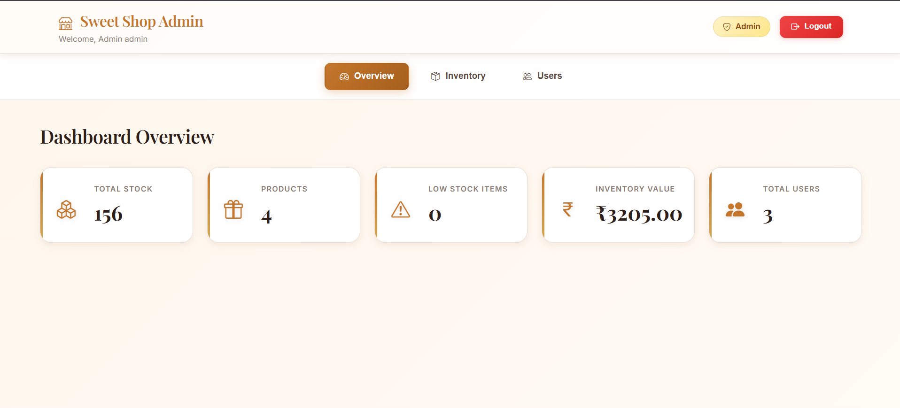
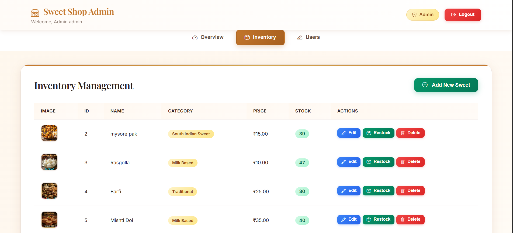
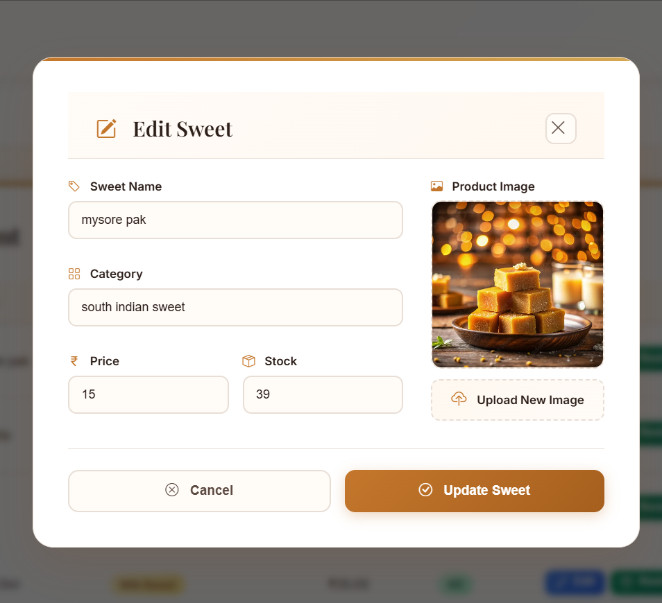
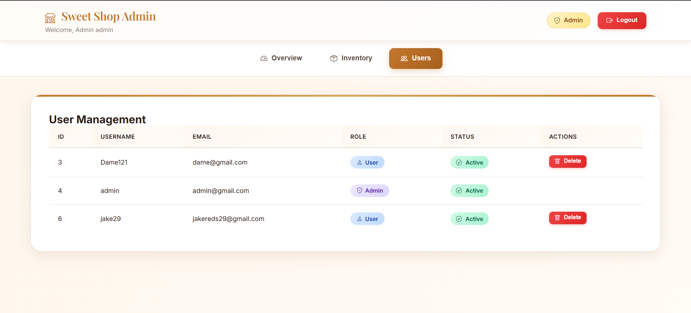

<p align="center">
  
  
  
  
  
</p>

# 🍬 Sweet Shop Management System

> A modern, full-stack web application for managing a sweet shop with role-based access control, real-time inventory tracking, and cloud-based image management.

---

## 📋 Table of Contents

- [Project Overview](#-project-overview)
- [Key Features](#-key-features)
- [Screenshots](#-screenshots)
- [Technology Stack](#️-technology-stack)
- [Getting Started](#-getting-started)
  - [Prerequisites](#prerequisites)
  - [Backend Setup](#backend-setup)
  - [Frontend Setup](#frontend-setup)
- [Running Tests](#-running-tests)
- [API Documentation](#-api-documentation)
- [My AI Usage](#-my-ai-usage)
- [Project Structure](#-project-structure)
- [Live Demo](#-live-demo)
- [Future Enhancements](#-future-enhancements)
- [Author](#-author)

---

## 🌐 Live Demo

**Frontend (Vercel):** [https://tdd-kata-sweet-shop-management-syst-alpha.vercel.app/](https://tdd-kata-sweet-shop-management-syst-alpha.vercel.app/)

> ⚠️ **Note:** Due to time constraints, the backend is not fully deployed yet. The live demo shows the frontend UI, but the API functionality requires running the backend locally. See [Future Enhancements](#-future-enhancements) for planned improvements.

---

## 🎯 Project Overview

The **Sweet Shop Management System** is a comprehensive full-stack application designed to streamline sweet shop operations. Built using **Test-Driven Development (TDD)** principles, this project demonstrates modern web development practices with a focus on:

- **Secure Authentication**: JWT-based authentication with role-based access control
- **Real-time Inventory**: Automatic stock updates with purchase and restock operations
- **Cloud Image Storage**: Integrated with ImageKit.io CDN for fast image delivery
- **Modern UI/UX**: Premium design with responsive layouts and intuitive interactions
- **Comprehensive Testing**: 76 tests achieving 70% code coverage

### Problem Statement

Traditional sweet shops often struggle with:
- Manual inventory tracking leading to stock discrepancies
- No digital presence for customer browsing
- Difficulty in managing multiple users and roles
- Paper-based record keeping

### Solution

This application provides:
- **Digital storefront** for customers to browse and purchase
- **Admin dashboard** for complete inventory control
- **Automated stock management** with real-time updates
- **Secure multi-user system** with role-based permissions

---

## ✨ Key Features

### 👤 For Customers (User Dashboard)
| Feature | Description |
|---------|-------------|
| 🔐 Secure Login | JWT authentication with form validation |
| 🛍️ Browse Sweets | View all available sweets with images and prices |
| 🔍 Smart Search | Filter by name, category, and price range |
| 🛒 Easy Purchase | Custom modal with quantity selection and total calculation |
| 📱 Responsive Design | Works seamlessly on desktop, tablet, and mobile |

### 👑 For Administrators (Admin Dashboard)
| Feature | Description |
|---------|-------------|
| 📊 Dashboard Overview | Statistics for total stock, products, and inventory value |
| ➕ Add Sweets | Create new items with image upload to cloud CDN |
| ✏️ Edit Products | Update details with real-time image preview |
| 📦 Restock Items | Quick restock functionality for low-stock alerts |
| 👥 User Management | View and manage all registered users |
| 🗑️ Delete Items | Remove products with automatic image cleanup |

---

## 📸 Screenshots

### 🔐 Authentication

<table>
  <tr>
    <td width="50%">
      <h4 align="center">Login Page</h4>
      
      <p align="center"><em>Secure login with form validation and error handling</em></p>
    </td>
    <td width="50%">
      <h4 align="center">Sign Up Page</h4>
      
      <p align="center"><em>User registration with email, password, and username validation</em></p>
    </td>
  </tr>
</table>

### 🛍️ User Dashboard

<table>
  <tr>
    <td width="50%">
      <h4 align="center">Browse Sweets</h4>
      
      <p align="center"><em>Browse available sweets with search and filter options</em></p>
    </td>
    <td width="50%">
      <h4 align="center">Purchase Button Click</h4>
      
      <p align="center"><em>User clicking on the purchase button</em></p>
    </td>
  </tr>
  <tr>
    <td colspan="2" align="center">
      <h4 align="center">Purchase Modal</h4>
      
      <p align="center"><em>Custom purchase modal with quantity selector and total calculation</em></p>
    </td>
  </tr>
</table>

### 👑 Admin Dashboard

<table>
  <tr>
    <td width="33%">
      <h4 align="center">Dashboard Overview</h4>
      
      <p align="center"><em>Statistics and low-stock alerts</em></p>
    </td>
    <td width="33%">
      <h4 align="center">Inventory Management</h4>
      
      <p align="center"><em>Full CRUD operations on sweets</em></p>
    </td>
    <td width="33%">
      <h4 align="center">Edit Item Click</h4>
      
      <p align="center"><em>Admin clicking edit on inventory item</em></p>
    </td>
  </tr>
  <tr>
    <td colspan="3" align="center">
      <h4 align="center">Add/Edit Modal</h4>
      
      <p align="center"><em>Modal with image preview and upload</em></p>
    </td>
  </tr>
</table>

---

## 🛠️ Technology Stack

### Backend
| Technology | Purpose |
|------------|---------|
| **FastAPI** | High-performance Python web framework |
| **SQLAlchemy** | ORM for database operations |
| **SQLite** | Lightweight database for development |
| **JWT (python-jose)** | Secure token-based authentication |
| **Passlib + bcrypt** | Password hashing and verification |
| **ImageKit.io SDK** | Cloud image storage and CDN |
| **Pydantic** | Data validation and serialization |

### Frontend
| Technology | Purpose |
|------------|---------|
| **React 18.2** | Component-based UI library |
| **Tailwind CSS 3.x** | Utility-first CSS framework for modern styling |
| **PostCSS** | CSS transformation with Autoprefixer |
| Technology | Purpose |
|------------|---------|
| **Pytest** | Testing framework |
| **pytest-cov** | Coverage reporting |
| **httpx** | Async HTTP testing |

---

## 🚀 Getting Started

### Prerequisites

Before you begin, ensure you have the following installed:

| Requirement | Version | Download |
|-------------|---------|----------|
| Python | 3.12+ | [python.org](https://www.python.org/downloads/) |
| Node.js | 18+ | [nodejs.org](https://nodejs.org/) |
| Git | Latest | [git-scm.com](https://git-scm.com/) |
| ImageKit Account | - | [imagekit.io](https://imagekit.io/) (free tier available) |

---

### Backend Setup

#### Step 1: Clone the Repository

```bash
git clone https://github.com/Dame121/TDD-Kata-Sweet-Shop-Management-System.git
cd "Sweet Shop Managemen  System"
```

#### Step 2: Navigate to Backend Directory

```bash
cd backend
```

#### Step 3: Install Dependencies

```bash
pip install -r requirements.txt
```

#### Step 4: Configure Environment Variables (in project root)

Create a `.env` file in the **backend** directory:

```env
# Application Settings
APP_TITLE=Sweet Shop Management System
APP_VERSION=1.0.0
DEBUG=True

# Security
SECRET_KEY=your-super-secret-key-change-in-production
ACCESS_TOKEN_EXPIRE_MINUTES=30

# Database
DATABASE_URL=sqlite:///./sweet_shop.db

# CORS
CORS_ORIGINS=*

# ImageKit.io Configuration (Get from https://imagekit.io/dashboard)
IMAGEKIT_PRIVATE_KEY=your_private_key_here
IMAGEKIT_PUBLIC_KEY=your_public_key_here
IMAGEKIT_URL_ENDPOINT=https://ik.imagekit.io/your_imagekit_id
```

> ⚠️ **Important**: Replace the placeholder values with your actual ImageKit.io credentials from the [ImageKit Dashboard](https://imagekit.io/dashboard).

#### Step 5: Create Admin User

```bash
python scripts/create_first_admin.py
```

> **Auto-created credentials if running first time:**
> - Username: `admin`
> - Password: `admin123`

This creates the default admin account:
- **Username**: `admin`
- **Password**: `admin123`

#### Step 6: Start Backend Server

```bash
python main.py
```

✅ Backend running at: **http://localhost:8000**

📖 API Documentation: **http://localhost:8000/docs**  
📖 ReDoc: **http://localhost:8000/api/redoc**

#### Step 7: Start Frontend Server

Open a **new terminal window** and navigate to the frontend:

```bash
cd frontend
npm install  # Run only if you haven't installed dependencies
npm start
```

✅ Frontend running at: **http://localhost:3000**

---

### Quick Start (Automated - Windows Only)

For convenience, run this in the **project root** directory:

```bash
.\start.bat
```

Or for PowerShell:

```powershell
.\start.ps1
```

This will automatically:
- Activate the Python virtual environment
- Start the FastAPI backend on port 8000
- Start the React frontend on port 3000 (in a new window)

> **Note:** You'll see both services running simultaneously - perfect for development!

---

## 🧪 Running Tests

### Run All Tests

```bash
pytest -v
```

### Run with Coverage Report

```bash
pytest --cov=backend --cov-report=html --cov-report=term
```

### View HTML Coverage Report

```bash
# Windows
start htmlcov/index.html

# macOS
open htmlcov/index.html

# Linux
xdg-open htmlcov/index.html
```

### Test Results Summary

| Metric | Value |
|--------|-------|
| **Total Tests** | 76 |
| **Passing** | 76 (100%) |
| **Overall Coverage** | 70% |

#### Coverage by Module

| Module | Coverage |
|--------|----------|
| `app.py` | 100% |
| `database.py` | 91% |
| `auth_utils.py` | 90% |
| `sweets.py` | 74% |
| `users.py` | 69% |
| `admins.py` | 62% |

---

## 📚 API Documentation

### Authentication Endpoints

| Method | Endpoint | Description | Auth |
|--------|----------|-------------|------|
| `POST` | `/api/auth/register` | Register new user | ❌ |
| `POST` | `/api/auth/login` | User login | ❌ |
| `GET` | `/api/auth/me` | Get current user | ✅ |
| `GET` | `/api/auth/` | Get all users | 👑 Admin |
| `DELETE` | `/api/auth/{user_id}` | Delete user | 👑 Admin |

### Sweets Management

| Method | Endpoint | Description | Auth |
|--------|----------|-------------|------|
| `GET` | `/api/sweets/` | List all sweets | ✅ |
| `GET` | `/api/sweets/{id}` | Get sweet by ID | ✅ |
| `GET` | `/api/sweets/search` | Search sweets | ✅ |
| `POST` | `/api/sweets/` | Create sweet | 👑 Admin |
| `PUT` | `/api/sweets/{id}` | Update sweet | 👑 Admin |
| `DELETE` | `/api/sweets/{id}` | Delete sweet | 👑 Admin |
| `PUT` | `/api/sweets/{id}/image` | Update image | 👑 Admin |

### Inventory Operations

| Method | Endpoint | Description | Auth |
|--------|----------|-------------|------|
| `POST` | `/api/sweets/{id}/purchase` | Purchase sweet | ✅ |
| `POST` | `/api/sweets/{id}/restock` | Restock sweet | 👑 Admin |

> 📖 **Interactive API Documentation**: Visit `http://localhost:8000/docs` for Swagger UI

---

## 🤖 My AI Usage

Throughout this project, I used **GitHub Copilot** and **Claude Sonnet** as my coding companions. Here's an honest look at how AI helped me build this application and what I learned along the way.

### How I Actually Used AI

#### Getting Started Was So Much Faster

When I started this project, I knew I wanted to use FastAPI with SQLAlchemy, but setting up all the boilerplate code from scratch would've taken forever. I asked Copilot to help me scaffold the initial project structure things like the database models, CORS configuration, and basic routing. For more complex decisions, I'd chat with Claude Sonnet to think through architecture choices and get explanations for why certain patterns work better than others. This let me jump straight into the interesting parts: figuring out how the authentication should work and designing the user experience.

#### The Authentication System

Building JWT authentication from scratch is tricky, and honestly, it's easy to mess up security stuff. I used Copilot to generate the token creation and validation logic, and it helped me implement password hashing with bcrypt properly. But here's the thing I still had to think through the role based access control myself. The AI gave me the building blocks, but deciding *who* should access *what* was entirely my decision.

#### Writing Tests (Yes, All 76 of Them)

I'll be honest writing tests can feel tedious sometimes. Copilot was great for generating the repetitive parts, like test fixtures and basic CRUD test templates. But when it came to edge cases (what happens if someone tries to purchase more items than in stock? what if an admin tries to delete themselves?), I had to design those scenarios myself. The AI helped me write tests faster, but I made sure they were actually *meaningful* tests.

#### Building the React Frontend

For the frontend, Copilot helped with component boilerplate and the fetch API patterns for talking to my backend. The time saver here was huge. But the look and feel? That was all me. I designed the warm, premium aesthetic you see the color palette, the purchase modal (I really didn't want to use boring browser prompts!), and all the little UX touches that make it feel polished.

#### Integrating ImageKit.io

This was interesting I'd never used ImageKit before. Copilot helped me figure out the SDK integration and how to handle FormData for image uploads. When things broke (and they did!), I'd paste the error and ask for debugging help. It's like having a rubber duck that actually talks back.

### What I Learned About Working With AI

**The Good Stuff:**
- I built features way faster than I would have alone
- AI suggestions often included error handling I might've forgotten
- I learned new patterns just by seeing what Copilot suggested
- I could focus my brain power on the *hard* problems instead of syntax

**The Tricky Parts:**
- Sometimes I caught myself accepting suggestions without really reading them had to consciously slow down
- A few times the AI suggested outdated patterns, so I always double-checked against the docs
- For anything security related, I made sure to verify best practices independently

### My Honest Take

AI didn't write this project for me it was more like pair programming with a very fast, very patient partner. I still made all the architecture decisions, designed the user experience, and thought through the edge cases. But for the stuff that's tedious or easy to get wrong (like JWT boilerplate or test fixtures), having AI help meant I could build something more polished in less time.

The way I see it: AI is great at the *how* (syntax, patterns, boilerplate), but the *what* and *why* still need a human brain.

#### Trying to Deploy (Render + Vercel)

Towards the end of the project, I wanted to deploy the application so others could see it live. I asked Copilot for a step-by-step guide on how to deploy a FastAPI backend to Render and a React frontend to Vercel. It walked me through creating the necessary config files (`Procfile`, `render.yaml`, `vercel.json`), setting up environment variables, and configuring the frontend to use dynamic API URLs. I managed to get the frontend deployed to Vercel successfully! However, due to time constraints, I wasn't able to fully set up and test the backend deployment on Render. It's on my list of things to complete soon.

---

## 📁 Project Structure

```
Sweet Shop Management System/
│
├── 📂 backend/                    # Backend Application
│   ├── 📂 api/
│   │   ├── 📂 auth/              # Authentication endpoints
│   │   │   ├── users.py          # User registration & login
│   │   │   └── admins.py         # Admin management
│   │   └── 📂 sweets/            # Sweet management endpoints
│   │       └── sweets.py         # CRUD operations
│   ├── app.py                    # FastAPI application entry
│   ├── database.py               # SQLAlchemy models
│   ├── auth_utils.py             # JWT utilities
│   └── imagekit_utils.py         # ImageKit integration
│
├── 📂 frontend/                   # React Application (Tailwind CSS)
│   ├── 📂 public/                # Static files
│   ├── 📂 src/
│   │   ├── 📂 components/Pages/  # Dashboard components
│   │   │   ├── AdminDashboard.js # Admin dashboard
│   │   │   ├── UserDashboard.js  # User dashboard
│   │   │   └── *.css             # Component styles
│   │   ├── 📂 configs/           # API configuration
│   │   │   └── apiConfig.js      # API endpoints
│   │   ├── 📂 auth/              # Authentication utilities
│   │   ├── App.js                # Main app with Tailwind styling
│   │   ├── index.css             # Global + Tailwind directives
│   │   └── index.js              # React entry point
│   ├── tailwind.config.js        # Tailwind CSS configuration
│   ├── postcss.config.js         # PostCSS plugin config
│   ├── package.json              # Node dependencies
│   └── vercel.json               # Vercel deployment config
│
├── 📂 tests/                      # Test Suite
│   ├── conftest.py               # Pytest fixtures
│   ├── test_auth.py              # Authentication tests
│   ├── test_sweets.py            # Sweet CRUD tests
│   ├── test_inventory.py         # Purchase/restock tests
│   └── test_admin.py             # Admin-specific tests
│
├── 📂 screenshots/                # Application screenshots
├── 📂 scripts/                    # Utility scripts
├── 📂 docs/                       # Additional documentation
│
├── main.py                        # Application entry point
├── requirements.txt               # Python dependencies
├── pytest.ini                     # Pytest configuration
└── README.md                      # This file
```

---

## 🔑 Default Credentials

### Admin Account
| Field | Value |
|-------|-------|
| Username | `admin` |
| Password | `admin123` |

### Test User Account
| Field | Value |
|-------|-------|
| Username | `testuser` |
| Password | `password123` |

> ⚠️ **Security Note**: Change these credentials before deploying to production.

---

## � Future Enhancements

Here are some improvements I plan to make when time permits:

| Enhancement | Description |
|-------------|-------------|
| **Full Backend Deployment** | Complete the Render deployment with PostgreSQL database for persistent storage |
| **Database Migration** | Migrate from SQLite to PostgreSQL for production-ready data persistence |
| **CI/CD Pipeline** | Set up GitHub Actions for automated testing and deployment |
| **User Profiles** | Add profile pictures and order history for users |
| **Payment Integration** | Integrate a payment gateway for real transactions |
| **Email Notifications** | Send order confirmations and low-stock alerts |

---

## �👨‍💻 Author

<table>
  <tr>
    <td>
      <strong>Damewan Bareh</strong><br>
      <a href="https://github.com/Dame121">@Dame121</a>
    </td>
  </tr>
</table>

**Project Repository:** [TDD-Kata-Sweet-Shop-Management-System](https://github.com/Dame121/TDD-Kata-Sweet-Shop-Management-System)

---

## 📄 License

This project is licensed under the MIT License.

---

<p align="center">
  <strong>Built with ❤️ for the TDD Kata Assessment</strong><br>
  <em>Demonstrating modern full-stack development with transparent AI usage</em>
</p>


